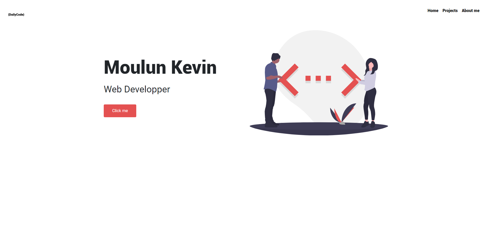

# Daily code

## Project Description:

Daily code is a project I kept doing for arround 50 days, the point was to push my projects as far as I was learning web developement 

## How to use it?

Just follow this [link](https://atndesign.github.io/dailycode/) .

## Techologies:

#### Languages

- HTML
- CSS
- JS

#### Framework

- SCSS
- ReactJs
- Bootstrap
- Gatsby
- GraphQL

## Screenshots

